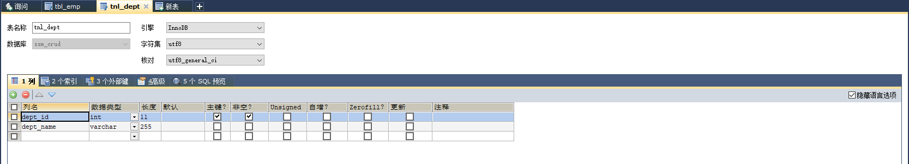
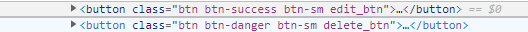

# SSM-CRUD

ssm:SpringMVC+Spring+MyBatis

CRUD：Create（创建）、Retrieve（查询）、Update（更新）、Delete（删除）


功能点：

• 1、分页

• 2、数据校验

• jquery前端校验+JSR303后端校验

• 3、ajax

• 4、Rest风格的URI；使用HTTP协议请求方式的动词，来表示对资源的操作（GET（查询），POST（新增），PUT（修改），DELETE（删 l


   除））


技术点：

• 基础框架-ssm（SpringMVC+Spring+MyBatis） 

• 数据库-MySQL

• 前端框架-bootstrap快速搭建简洁美观的界面

• 项目的依赖管理-Maven

• 分页-pagehelper

• 逆向工程-MyBatis Generator


## 基础环境搭建

### 1、创建一个maven工程

### 2、引入项目依赖的jar包 

spring

springmvc

mybatis

数据库连接池，驱动包

其他（jstl，servlet-api，junit）

```xml
        <dependencies>
            <!--引入依赖jar包-->
    <!--        spring-webmvc-->
            <!-- https://mvnrepository.com/artifact/org.springframework/spring-webmvc -->
            <dependency>
                <groupId>org.springframework</groupId>
                <artifactId>spring-webmvc</artifactId>
                <version>4.3.30.RELEASE</version>
            </dependency>

    <!--        spring-jdbc-->
            <!-- https://mvnrepository.com/artifact/org.springframework/spring-jdbc -->
            <dependency>
                <groupId>org.springframework</groupId>
                <artifactId>spring-jdbc</artifactId>
                <version>4.3.30.RELEASE</version>
            </dependency>

    <!--        Spring面向切面编程-->
            <!-- https://mvnrepository.com/artifact/org.springframework/spring-aspects -->
            <dependency>
                <groupId>org.springframework</groupId>
                <artifactId>spring-aspects</artifactId>
                <version>4.3.30.RELEASE</version>
            </dependency>


    <!--        引入mybatis-->
            <!-- https://mvnrepository.com/artifact/org.mybatis/mybatis -->
            <dependency>
                <groupId>org.mybatis</groupId>
                <artifactId>mybatis</artifactId>
                <version>3.4.6</version>
            </dependency>

    <!--        mybatis整合spring适配包-->
            <!-- https://mvnrepository.com/artifact/org.mybatis/mybatis-spring -->
            <dependency>
                <groupId>org.mybatis</groupId>
                <artifactId>mybatis-spring</artifactId>
                <version>1.3.3</version>
            </dependency>

    <!--        数据库连接池，驱动-->
            <!-- https://mvnrepository.com/artifact/c3p0/c3p0 -->
            <dependency>
                <groupId>c3p0</groupId>
                <artifactId>c3p0</artifactId>
                <version>0.9.1.2</version>
            </dependency>
            <!-- https://mvnrepository.com/artifact/mysql/mysql-connector-java -->
            <dependency>
                <groupId>mysql</groupId>
                <artifactId>mysql-connector-java</artifactId>
                <version>5.1.49</version>
            </dependency>

    <!--        引入jstl、ServletApi，junit-->
            <!-- https://mvnrepository.com/artifact/jstl/jstl -->
            <dependency>
                <groupId>jstl</groupId>
                <artifactId>jstl</artifactId>
                <version>1.2</version>
            </dependency>
            <!-- https://mvnrepository.com/artifact/javax.servlet/javax.servlet-api -->
            <dependency>
                <groupId>javax.servlet</groupId>
                <artifactId>javax.servlet-api</artifactId>
                <version>3.0.1</version>
                <scope>provided</scope>
            </dependency>
            <!-- https://mvnrepository.com/artifact/junit/junit -->
            <dependency>
                <groupId>junit</groupId>
                <artifactId>junit</artifactId>
                <version>4.12</version>
                <scope>test</scope>
            </dependency>
        </dependencies>
```

引入Spring mvc框架依赖 


### 3、引入bootstrap前端框架

下载boostrap，解压文件


将文件放入static文件夹内


根据官方文档，在index.jsp内引入相关内容

```xml
    <%--    引入jquery--%>
    <script type="text/javascript" src="js/jquery-3.4.1.js"></script>
    <%--    引入样式--%>
    <link rel="stylesheet" href="boostrap/bootstrap-4.4.1-dist/css/bootstrap.min.css">
    <script src="boostrap/bootstrap-4.4.1-dist/js/bootstrap.min.js"></script>
```


### 4、编写ssm整合的关键配置文件

 `web.xml`、`spring`、`springmvc`、`mybatis`，使用`mybatis`的逆向工程生成对应的`bean`以及`mapper`


#### `web.xml`编写

```xml
<?xml version="1.0" encoding="UTF-8"?>
<web-app xmlns="http://xmlns.jcp.org/xml/ns/javaee"
         xmlns:xsi="http://www.w3.org/2001/XMLSchema-instance"
         xsi:schemaLocation="http://xmlns.jcp.org/xml/ns/javaee http://xmlns.jcp.org/xml/ns/javaee/web-app_4_0.xsd"
         version="4.0">
<!--Spring-->
<!--    1-启动Spring的容器-->
    <context-param>
        <param-name>contextConfigLocation</param-name>
        <!--    这里很重要，是参数-->
        <param-value>classpath:conf/applicationContext.xml</param-value>
    </context-param>

    <listener>
        <listener-class>org.springframework.web.context.ContextLoaderListener</listener-class>
    </listener>

<!--    2-spring的前端控制器，拦截所有请求-->
    <servlet>
        <servlet-name>dispatcherServlet</servlet-name>
        <servlet-class>org.springframework.web.servlet.DispatcherServlet</servlet-class>
        <init-param>
            <param-name>contextConfigLocation</param-name>
            <param-value>classpath:conf/dispatcherServlet.xml</param-value>
        </init-param>
        <load-on-startup>1</load-on-startup>
    </servlet>
    
    <servlet-mapping>
        <servlet-name>dispatcherServlet</servlet-name>
        <url-pattern>/</url-pattern>
    </servlet-mapping>

<!--    3-字符编码过滤器-->
    <filter>
        <filter-name>characterEncodingFilter</filter-name>
        <filter-class>org.springframework.web.filter.CharacterEncodingFilter</filter-class>
        <init-param>
            <param-name>encoding</param-name>
            <param-value>utf-8</param-value>
        </init-param>
        <init-param>
            <param-name>forceRequestEncoding</param-name>
            <param-value>true</param-value>
        </init-param>
        <init-param>
            <param-name>forceResponseEncoding</param-name>
            <param-value>true</param-value>
        </init-param>
    </filter>
    <filter-mapping>
        <filter-name>characterEncodingFilter</filter-name>
        <url-pattern>/*</url-pattern>
    </filter-mapping>

<!--    4-使用Rest风格的URI-->
    <filter>
        <filter-name>hiddenHttpMethodFilter</filter-name>
        <filter-class>org.springframework.web.filter.HiddenHttpMethodFilter</filter-class>
    </filter>
    <filter-mapping>
        <filter-name>hiddenHttpMethodFilter</filter-name>
        <url-pattern>/*</url-pattern>
    </filter-mapping>
</web-app>
```

#### `SpringMVC`配置：

```xml
<?xml version="1.0" encoding="UTF-8"?>
<beans xmlns="http://www.springframework.org/schema/beans"
       xmlns:xsi="http://www.w3.org/2001/XMLSchema-instance"
       xmlns:context="http://www.springframework.org/schema/context"
       xmlns:mvc="http://www.springframework.org/schema/mvc"
       xsi:schemaLocation="http://www.springframework.org/schema/beans http://www.springframework.org/schema/beans/spring-beans.xsd http://www.springframework.org/schema/context https://www.springframework.org/schema/context/spring-context.xsd http://www.springframework.org/schema/mvc https://www.springframework.org/schema/mvc/spring-mvc.xsd">

<!--    SpringMVC的配置文件，包含网站跳转逻辑的控制，配置-->
    <context:component-scan base-package="com.atguigu" use-default-filters="false">
<!--        只扫控制器-->
        <context:include-filter type="annotation" expression="org.springframework.stereotype.Controller"/>
    </context:component-scan>

<!--    配置视图解析器，方便页面返回-->
    <bean class="org.springframework.web.servlet.view.InternalResourceViewResolver">
        <property name="prefix" value="/WEB-INF/views"></property>
        <property name="suffix" value=".jsp"></property>
    </bean>

<!--    两个标准配置-->
<!--    springmvc不能处理的请求转交给Tomcat-->
    <mvc:default-servlet-handler/>
<!--    springmvc更高级的一些功能，JSR303校验，快捷的ajax....映射动态请求-->
    <mvc:annotation-driven/>
    
</beans>
```


#### `Spring`配置

```xml
<?xml version="1.0" encoding="UTF-8"?>
<beans xmlns="http://www.springframework.org/schema/beans"
       xmlns:xsi="http://www.w3.org/2001/XMLSchema-instance"
       xmlns:context="http://www.springframework.org/schema/context"
       xmlns:aop="http://www.springframework.org/schema/aop" xmlns:tx="http://www.springframework.org/schema/tx"
       xsi:schemaLocation="http://www.springframework.org/schema/beans http://www.springframework.org/schema/beans/spring-beans.xsd http://www.springframework.org/schema/context https://www.springframework.org/schema/context/spring-context.xsd http://www.springframework.org/schema/aop https://www.springframework.org/schema/aop/spring-aop.xsd http://www.springframework.org/schema/cache http://www.springframework.org/schema/cache/spring-cache.xsd http://www.springframework.org/schema/tx http://www.springframework.org/schema/tx/spring-tx.xsd">

    <context:component-scan base-package="com.atguigu">
        <context:exclude-filter type="annotation" expression="org.springframework.stereotype.Controller"/>
    </context:component-scan>
<!--    Spring的配置文件，这里主要配置和业务逻辑有关的-->
<!--===========================数据源，业务控制===========================-->
    <context:property-placeholder location="classpath:conf/dbconfig.properties"/>
    
    <bean id="pooledDataSource" class="com.mchange.v2.c3p0.ComboPooledDataSource">
        <property name="jdbcUrl" value="${jdbc.jdbcUrl}"></property>
        <property name="driverClass" value="${jdbc.driverClass}"></property>
        <property name="user" value="${jdbc.user}"></property>
        <property name="password" value="${jdbc.password}"></property>
    </bean>

<!--===========================配置和Mybatis的整合=========================-->
    <bean id="sessionFactory" class="org.mybatis.spring.SqlSessionFactoryBean">
<!--        指定mybatis全局配置文件-->
        <property name="configLocation" value="classpath:conf/mybatis_config.xml"></property>
        <property name="dataSource" ref="pooledDataSource"></property>
<!--        指定mybatis，Mapper文件的位置-->
        <property name="mapperLocations" value="classpath:mapper/*.xml"></property>
    </bean>

<!--    配置扫描器，将mybatis接口实现加入到ioc容器中-->
    <bean class="org.mybatis.spring.mapper.MapperScannerConfigurer">
<!--        扫描所有dao接口的实现，加入到ioc容器中-->
        <property name="basePackage" value="com.atguigu.crud.dao"></property>
    </bean>


<!--===========================事务控制的配置===========================-->
    <bean id="dataSourceTransactionManager" class="org.springframework.jdbc.datasource.DataSourceTransactionManager">
<!--        控制住数据源-->
        <property name="dataSource" ref="pooledDataSource"></property>
    </bean>

<!--    开启基于注解的事务，使用xml配置形式的事务（比较重要的使用配置式）-->
    <aop:config>
<!--        切入点表达式-->
        <aop:pointcut id="txPoint" expression="execution(* com.atguigu.crud.service..*(..))"/>
<!--        配置事务增强-->
        <aop:advisor advice-ref="txAdvice" pointcut-ref="txPoint"></aop:advisor>
    </aop:config>
    
    <!--    配置事务增强-->
    <tx:advice id="txAdvice" transaction-manager="dataSourceTransactionManager">
        <tx:attributes>
            <!--            所有方法都是事务方法-->
            <tx:method name="*"/>
            <!--                以get开始的方法-->
            <tx:method name="get*" read-only="true"/>
        </tx:attributes>
    </tx:advice>

<!--    Spring配置文件的核心点(数据源，与mybatis的整合)-->
    
</beans>
```

#### `mybatis`的配置文件


```xml
<?xml version="1.0" encoding="UTF-8" ?>
<!DOCTYPE configuration
        PUBLIC "-//mybatis.org//DTD Config 3.0//EN"
        "http://mybatis.org/dtd/mybatis-3-config.dtd">
<configuration>
    <settings>
        <setting name="mapUnderscoreToCamelCase" value="true"/>
    </settings>
    
    <typeAliases>
        <package name="com.atguigu.crud.bean"/>
    </typeAliases>
</configuration>
```

#### 新建ssm_crud表：




#### 使用mybatis的逆向工程生成对应的Bean以及Mapper:

##### 使用Maven添加Generator的依赖：


```xml
<!--        MBG-->
        <dependency>
            <groupId>org.mybatis.generator</groupId>
            <artifactId>mybatis-generator-core</artifactId>
            <version>1.4.0</version>
        </dependency>
```

##### 配置GeneratorXML：


在当前工程新建XML文件：


```xml
<?xml version="1.0" encoding="UTF-8"?>
<!DOCTYPE generatorConfiguration
        PUBLIC "-//mybatis.org//DTD MyBatis Generator Configuration 1.0//EN"
        "http://mybatis.org/dtd/mybatis-generator-config_1_0.dtd">

<generatorConfiguration>

    <context id="DB2Tables" targetRuntime="MyBatis3">
<!--        配置数据库连接信息-->
        <jdbcConnection driverClass="com.mysql.jdbc.Driver"
                        connectionURL="jdbc:mysql://localhost:3306/ssm_crud"
                        userId="root"
                        password="root">
        </jdbcConnection>

        <javaTypeResolver >
            <property name="forceBigDecimals" value="false" />
        </javaTypeResolver>

<!--        指定javabean生成的位置-->
        <javaModelGenerator
                targetPackage="com.atguigu.crud.bean"
                targetProject=".\src\main\java">
            <property name="enableSubPackages" value="true" />
            <property name="trimStrings" value="true" />
        </javaModelGenerator>

<!--        指定sql映射文件生成的位置-->
        <sqlMapGenerator
                targetPackage="mapper"
                targetProject=".\src\main\resources">
            <property name="enableSubPackages" value="true" />
        </sqlMapGenerator>

<!--        指定dao接口生成的位置,Mapper接口-->
        <javaClientGenerator
                type="XMLMAPPER"
                targetPackage="com.atguigu.crud.dao"
                targetProject=".\src\main\java">
            <property name="enableSubPackages" value="true" />
        </javaClientGenerator>

<!--        table指定每个表的生成策略-->
        <table tableName="tbl_emp" domainObjectName="Employee"></table>
        <table tableName="tbl_dept" domainObjectName="Department"></table>
        
    </context>
</generatorConfiguration>
```

##### 运行Generator：


新建test/MBGTest.class：既可以运行

```java
public class MGBTest {
    @Test
    public static void main(String[] args) throws Exception {
        List<String> warnings = new ArrayList<String>();
        boolean overwrite = true;
        File configFile = new File("mbg.xml");
        ConfigurationParser cp = new ConfigurationParser(warnings);
        Configuration config = cp.parseConfiguration(configFile);
        DefaultShellCallback callback = new DefaultShellCallback(overwrite);
        MyBatisGenerator myBatisGenerator = new MyBatisGenerator(config, callback, warnings);
        myBatisGenerator.generate(null);
    }
}
```

##### 减少编译后文件的注释：


```xml
<!--        阻止生成注释-->
        <commentGenerator>
            <property name="suppressAllComments" value="true" />
        </commentGenerator>
```

##### 对Mapper增加功能：

dao.EmployeeMapper.class添加乡相应的方法

```java
List<Employee> selectByExampleWithDept(EmployeeExample example);

Employee selectByPrimaryKeyWithDept(Integer empId);
```

对bean.Employee进行属性添加：

```java
public class Employee {
    private Integer empId;

    private String empName;

    private String gender;

    private String email;

    private Integer dId;
    //希望查询员工的同时有部门的信息
    private Department department;
```

添加Mapper，查询带部门信息：

```xml
<!--  List<Employee> selectByExampleWithDept(EmployeeExample example);-->
<sql id="WithDept_Column_List" >
    e.emp_id, e.emp_name, e.gender, e.email, e.d_id, d.dept_id, d.dept_name
</sql>

<resultMap id="WithDept" type="com.atguigu.crud.bean.Employee">
    <id column="emp_id" jdbcType="INTEGER" property="empId" />
    <result column="emp_name" jdbcType="VARCHAR" property="empName" />
    <result column="gender" jdbcType="CHAR" property="gender" />
    <result column="email" jdbcType="VARCHAR" property="email" />
    <result column="d_id" jdbcType="INTEGER" property="dId" />
    <!--    指定联合查询出的部门字段封装-->
    <association property="department" javaType="com.atguigu.crud.bean.Department">
        <id column="dept_id" property="deptId"/>
        <result column="dept_name" property="deptName"/>
        <!--      主键用id标签-->
    </association>
</resultMap>

<select id="selectByExampleWithDept" resultMap="WithDept">
    select
    <if test="distinct">
        distinct
    </if>
    <include refid="WithDept_Column_List" />
    FROM tbl_emp e
    LEFT JOIN tbl_dept d ON e.`d_id`=d.`dept_id`
    <if test="_parameter != null">
        <include refid="Example_Where_Clause" />
    </if>
    <if test="orderByClause != null">
        order by ${orderByClause}
    </if>
</select>
```

```xml
<!--  Employee selectByPrimaryKeyWithDept(Integer empId);-->
<select id="selectByPrimaryKeyWithDept" parameterType="java.lang.Integer" resultMap="WithDeptResultMap">
    select
    <include refid="WithDept_Column_List" />
    FROM tbl_emp e
    LEFT JOIN tbl_dept d ON e.`d_id`=d.`dept_id`
    where emp_id = #{empId,jdbcType=INTEGER}
</select>
```

### 5、测试mapper

#### 方法一：

##### 1、新建测试类test.MapperTest.java

因为配置了ioc容器的文件，可以通过此容器拿到Mapper

```xml
<!--    配置扫描器，将mybatis接口实现加入到ioc容器中-->
<bean class="org.mybatis.spring.mapper.MapperScannerConfigurer">
    <!--        扫描所有dao接口的实现，加入到ioc容器中-->
    <property name="basePackage" value="com.atguigu.crud.dao"></property>
</bean>
```

##### 通过SpringIOC容器拿到相关的实现类：

```java
public class MapperTest {
    /**
     * 测试DepartmentMapper
     */
    @Test
    public void testCRUD(){
        //1、创建SpringIOC容器
        ApplicationContext ioc = new ClassPathXmlApplicationContext("applicationContext.xml");
        //2、从容器中获取Mapper
        DepartmentMapper bean = ioc.getBean(DepartmentMapper.class);
    }
}
```

#### 方法二：

##### 1、导入SpringTest依赖

```xml
<!-- https://mvnrepository.com/artifact/org.springframework/spring-test -->
<dependency>
    <groupId>org.springframework</groupId>
    <artifactId>spring-test</artifactId>
    <version>4.3.30.RELEASE</version>
    <scope>test</scope>
</dependency>
```

##### 2、@ContextConfiguration指定Spring配置文件的位置

##### 3、@RunWith（SpringJUnit4ClassRunner.class）指定使用测试单元的类

##### 4、直接使用@Autowired要使用的组件即可

```java
@RunWith(SpringJUnit4ClassRunner.class)
@ContextConfiguration(locations = {"classpath:conf/applicationContext.xml"})
public class MapperTest {
    @Autowired
    DepartmentMapper departmentMapper;
    @Test
    public void testCRUD(){
        departmentMapper.insertSelective(new Department(null,"电脑部"));
        departmentMapper.insertSelective(new Department(null,"手机部"));
    }
}
```

如果出现只能够插入一条信息，则说明c3p0导入错误，修改依赖：

```xml
<dependency>
    <groupId>com.mchange</groupId>
    <artifactId>c3p0</artifactId>
    <version>0.9.5.2</version>
</dependency>
```

##### 5、引入批量插入：

首先添加依赖：

```xml
<!--===========================配置一个可以执行批量的sqlSession===========================-->
<bean id="sqlSession" class="org.mybatis.spring.SqlSessionTemplate">
    <constructor-arg name="sqlSessionFactory" ref="sessionFactory"></constructor-arg>
    <constructor-arg name="executorType" value="BATCH"></constructor-arg>
</bean>
```

使用getMapper拿到相应的mapperImp：

```java
@RunWith(SpringJUnit4ClassRunner.class)
@ContextConfiguration(locations = {"classpath:conf/applicationContext.xml"})
public class MapperTest {
    @Autowired
    DepartmentMapper departmentMapper;
    @Autowired
    SqlSession sqlSession;
    @Autowired
    EmployeeMapper employeeMapper;
    @Test
    public void testCRUD(){
//        批量插入多个员工:批量，使用可以批量操作的sqlSession
        EmployeeMapper mapper = sqlSession.getMapper(EmployeeMapper.class);
        for(int i=0;i<1000;i++){
            String uid=UUID.randomUUID().toString().substring(0,5)+i;
            mapper.insertSelective(new Employee(null,uid,"M",uid + "@atguigu.com",1));
        }
    }
}
```

## 查询：1

1、访问index.jsp页面

2、inde.jsp页面发送查询员工列表请求

3、EmployeeController来接收请求，查出员工数据

4、来到list.jsp页面进行展示


### 编写Controller与Service：

#### 1、编写controller.EmployeeController类：

处理页面发送的/emps请求：

```java
/**
 * 处理员工的CRUD请求
 * @author XieShifeng
 * @create 2021-08-16 4:50
 */

@Controller
public class EmployeeController {

    @Autowired
    EmployeeService employeeService;

    @RequestMapping("/emps")
    public String getEmps(@RequestParam(value="pn",defaultValue = "1") Integer pn, Model model){

        //这不是一个分页查询
        //引入PageHelper分页插件
        //在查询之前只需要调用，传入页码，以及每页的大小
        PageHelper.startPage(pn,5);
        //startPage后面紧跟的查询，就是分页查询
        List<Employee> employees = employeeService.getAll();

        //使用pageInfo包装查询后的结果，只需要将pageInfo交给页面就行了
        //封装了详细的分页信息，包括我们查询出来的数据,传入连续显示的页数
        PageInfo page = new PageInfo(employees,5);
        model.addAttribute("pageInfo",page);`
        return "list";
    }
}
```

#### 2、编写service.EmployeeService类：

处理`employeeService.getAll()`

```java
@Service
public class EmployeeService {
    @Autowired
    EmployeeMapper employeeMapper;

    public List<Employee> getAll() {
        return employeeMapper.selectByExampleWithDept(null);
    }
}
```

#### 3、使用了PageHelper实现分页：

需要引用相关依赖，以及在MyBatis-Config.xml中创建bean对象

```xml
<dependency>
    <groupId>com.github.pagehelper</groupId>
    <artifactId>pagehelper</artifactId>
    <version>5.1.10</version>
</dependency>
```

```xml
<plugin interceptor="com.github.pagehelper.PageInterceptor">
    <!-- config params as the following -->
</plugin>
```

#### 4、使用Spring测试模块提供的请求测试功能：

新建测试类

```java
/**
 * 使用Spring测试模块提供的测试请求功能，测试crud请求的正确性
 * @author XieShifeng
 * @create 2021-08-16 5:27
 */

@RunWith(SpringJUnit4ClassRunner.class)
@WebAppConfiguration
@ContextConfiguration(locations = {"classpath:conf/applicationContext.xml","classpath:conf/dispatcherServlet.xml"})
public class MvcTest {
    //传入SpringMVC的ioc
    @Autowired
    WebApplicationContext context;
    //虚拟mvc请求，获取处理结果
    MockMvc mockMvc;
    @Before
    public void initMockcMvc(){
        mockMvc = MockMvcBuilders.webAppContextSetup(context).build();
    }
    @Test
    public void testPage() throws Exception {
        //模拟请求拿回返回值
        MvcResult result = mockMvc.perform(MockMvcRequestBuilders.get("/emps").param("pn", "5"))
                .andReturn();
        //请求成功以后，请求域中会有pageInfo;我们取出pageInfo进行验证
        MockHttpServletRequest request = result.getRequest();
        PageInfo pageInfo = (PageInfo) request.getAttribute("pageInfo");
        System.out.println("当前页码：" + pageInfo.getPageNum());
        System.out.println("当前页码：" + pageInfo.getPages());
        System.out.println("总页码数" + pageInfo.getTotal());
        System.out.println("在页面需要连续显示的页码");
        int[] nums = pageInfo.getNavigatepageNums();
        for(int i :nums){
            System.out.println(" "+i);
        }
    }
}
```

#### 5、编写list界面

因为index.jsp直接跳转到了list.jsp，所以需要写list.jsp,又因为数据存放在Model当中，实际是存放在request域，在jsp中拿出数据即可：

```xml
<%--
  Created by IntelliJ IDEA.
  User: 56597
  Date: 8/16
  Time: 4:51
  To change this template use File | Settings | File Templates.
--%>
<%@ page contentType="text/html;charset=UTF-8" language="java" %>
<%@ taglib uri="http://java.sun.com/jsp/jstl/core" prefix="c" %>
<html>
<head>
    <title>员工列表</title>
    <%
        pageContext.setAttribute("APP_PATH",request.getContextPath());
    %>
<%--    此处是以斜杠开头，没有斜杠结尾--%>

<%--    web路径
不以/开始的相对路径：找资源，以当前路径的路径为基准，经常容易出问题
以/开始的相对路径，找资源，以服务器的路径为标准（http://localhost:3306）;需要加上项目名称
--%>
        <%--    引入jquery--%>
        <script type="text/javascript" src="${APP_PATH}/js/jquery-3.4.1.js"></script>
        <%--    引入样式--%>
        <link rel="stylesheet" href="${APP_PATH}/boostrap/bootstrap-4.4.1-dist/css/bootstrap.min.css">
        <script src="${APP_PATH}/boostrap/bootstrap-4.4.1-dist/js/bootstrap.min.js"></script>
</head>
<body>
    <%--搭建显示页面--%>
    <div class="container">
<%--        标题--%>
        <div class="row">
            <div class="col-md-12">
                <h1>SSM-CRUD</h1>
            </div>
        </div>
    <%--        按钮--%>
        <div class="row">
            <div class="col-md-4 offset-md-8">
                <button class="btn btn-success">新增</button>
                <button class="btn btn-danger">删除</button>
            </div>
        </div>
<%--        显示表格数据--%>
        <div class="row">
            <div class="col-md-12">
                <table class="table table-hover">
                    <tr>
                        <th>#</th>
                        <th>empName</th>
                        <th>gender</th>
                        <th>email</th>
                        <th>deptName</th>
                        <th>操作</th>
                    </tr>
                    <c:forEach items="${pageInfo.list}" var="emp">
                        <tr>
                            <th>${emp.empId}</th>
                            <th>${emp.empName}</th>
                            <th>${emp.gender=="M"?"男":"女"}</th>
                            <th>${emp.email}</th>
                            <th>${emp.department.deptName}</th>
                            <th>
                                <button class="btn btn-success btn-sm">
                                    <svg xmlns="http://www.w3.org/2000/svg" width="16" height="16" fill="currentColor" class="bi bi-pen" viewBox="0 0 16 16">
                                        <path d="m13.498.795.149-.149a1.207 1.207 0 1 1 1.707 1.708l-.149.148a1.5 1.5 0 0 1-.059 2.059L4.854 14.854a.5.5 0 0 1-.233.131l-4 1a.5.5 0 0 1-.606-.606l1-4a.5.5 0 0 1 .131-.232l9.642-9.642a.5.5 0 0 0-.642.056L6.854 4.854a.5.5 0 1 1-.708-.708L9.44.854A1.5 1.5 0 0 1 11.5.796a1.5 1.5 0 0 1 1.998-.001zm-.644.766a.5.5 0 0 0-.707 0L1.95 11.756l-.764 3.057 3.057-.764L14.44 3.854a.5.5 0 0 0 0-.708l-1.585-1.585z"/>
                                    </svg>
                                    添加
                                </button>
                                <button class="btn btn-danger btn-sm">
                                    <svg xmlns="http://www.w3.org/2000/svg" width="16" height="16" fill="currentColor" class="bi bi-trash" viewBox="0 0 16 16">
                                        <path d="M5.5 5.5A.5.5 0 0 1 6 6v6a.5.5 0 0 1-1 0V6a.5.5 0 0 1 .5-.5zm2.5 0a.5.5 0 0 1 .5.5v6a.5.5 0 0 1-1 0V6a.5.5 0 0 1 .5-.5zm3 .5a.5.5 0 0 0-1 0v6a.5.5 0 0 0 1 0V6z"/>
                                        <path fill-rule="evenodd" d="M14.5 3a1 1 0 0 1-1 1H13v9a2 2 0 0 1-2 2H5a2 2 0 0 1-2-2V4h-.5a1 1 0 0 1-1-1V2a1 1 0 0 1 1-1H6a1 1 0 0 1 1-1h2a1 1 0 0 1 1 1h3.5a1 1 0 0 1 1 1v1zM4.118 4 4 4.059V13a1 1 0 0 0 1 1h6a1 1 0 0 0 1-1V4.059L11.882 4H4.118zM2.5 3V2h11v1h-11z"/>
                                    </svg>
                                    删除
                                </button>

                            </th>
                        </tr>
                    </c:forEach>


                </table>
            </div>
        </div>

<%--        显示分页数据--%>
        <div class="row">
<%--            分页信息--%>
            <div class="col-md-6">
                当前${pageInfo.pageNum}页,总${pageInfo.pages}页，总${pageInfo.total}条记录
            </div>
<%--            分页条--%>
            <div class="col-md-6">
                <nav aria-label="Page navigation example">
                    <ul class="pagination">
                        <li class="page-item"><a class="page-link" href="${APP_PATH}/emps?pn=1">首页</a></li>
                        <c:if test="${pageInfo.hasPreviousPage}">
                            <li class="page-item">
                                <a class="page-link" href="${APP_PATH}/emps?pn=${pageInfo.pageNum-1}" aria-label="Previous">
                                    <span aria-hidden="true">&laquo;</span>
                                </a>
                            </li>
                        </c:if>

                        <c:forEach items="${pageInfo.navigatepageNums}" var="nums">
                            <c:if test="${nums == pageInfo.pageNum}">
                                <li class="page-item active"><a class="page-link" href="#">${nums}</a></li>
                            </c:if>
                            <c:if test="${nums != pageInfo.pageNum}">
                                <li class="page-item"><a class="page-link" href="${APP_PATH}/emps?pn=${nums}">${nums}</a></li>
                            </c:if>
                        </c:forEach>

                        <c:if test="${pageInfo.hasNextPage}">
                            <li class="page-item">
                                <a class="page-link" href="${APP_PATH}/emps?pn=${pageInfo.pageNum+1}" aria-label="Next">
                                    <span aria-hidden="true">&raquo;</span>
                                </a>
                            </li>
                        </c:if>
                        <li class="page-item"><a class="page-link" href="${APP_PATH}/emps?pn=${pageInfo.pages}">末页</a></li>
                    </ul>
                </nav>
            </div>
        </div>
    </div>


</body>
</html>

```

得到界面：


## 查询2：使用ajax技术

提高系统的扩展性：

1、index.jsp页面直接发送ajax请求，进行员工分页数据的查询

2、服务器将查询的数据，以json字符串的形式返回浏览器

3、浏览器受到js字符串。可以使用js对json进行解析，使用js通过dom增删改变页面

4、返回json，实现客户端的无关性


### 1、修改controller.EmployeeController

首先需要添加`@ResponseBody`能够将数据包装成json数据：

```java
/**
     * 需要导入jason包
     * @param pn
     * @return
     */
@ResponseBody
@RequestMapping("/emps")
public PageInfo getEmpsWithJson(@RequestParam(value="pn",defaultValue = "1") Integer pn){

    //这不是一个分页查询
    //引入PageHelper分页插件
    //在查询之前只需要调用，传入页码，以及每页的大小
    PageHelper.startPage(pn,5);
    //startPage后面紧跟的查询，就是分页查询
    List<Employee> employees = employeeService.getAll();

    //使用pageInfo包装查询后的结果，只需要将pageInfo交给页面就行了
    //封装了详细的分页信息，包括我们查询出来的数据,传入连续显示的页数
    PageInfo page = new PageInfo(employees,5);
    return page;
}
```

### 2、添加json依赖

添加`@ResponseBody`需要json的相关依赖：

```xml
<!-- https://mvnrepository.com/artifact/com.fasterxml.jackson.core/jackson-databind -->
<dependency>
    <groupId>com.fasterxml.jackson.core</groupId>
    <artifactId>jackson-databind</artifactId>
    <version>2.12.4</version>
</dependency>
```

打包好的json数据

```
{"total":1997,"list":[{"empId":3,"empName":"e17ed2","gender":"M","email":"e17ed2@atguigu.com","dId":1,"department":{"deptId":1,"deptName":"电脑部"}},{"empId":4,"empName":"e93033","gender":"M","email":"e93033@atguigu.com","dId":1,"department":{"deptId":1,"deptName":"电脑部"}},{"empId":5,"empName":"3affd4","gender":"M","email":"3affd4@atguigu.com","dId":1,"department":{"deptId":1,"deptName":"电脑部"}},{"empId":6,"empName":"934135","gender":"M","email":"934135@atguigu.com","dId":1,"department":{"deptId":1,"deptName":"电脑部"}},{"empId":7,"empName":"c2bc96","gender":"M","email":"c2bc96@atguigu.com","dId":1,"department":{"deptId":1,"deptName":"电脑部"}}],"pageNum":1,"pageSize":5,"size":5,"startRow":1,"endRow":5,"pages":400,"prePage":0,"nextPage":2,"isFirstPage":true,"isLastPage":false,"hasPreviousPage":false,"hasNextPage":true,"navigatePages":5,"navigatepageNums":[1,2,3,4,5],"navigateFirstPage":1,"navigateLastPage":5}
```

### 3、设置通用返回类

```java
public class Msg {

    //状态码100-成功 200-失败
    private int code;
    //提示信息
    private  String msg;
    //用户要返回给浏览器的数据
    private Map<String,Object> extend = new HashMap<>();

    public static Msg success(){
        Msg result = new Msg();
        result.setCode(100);
        result.setMsg("处理成功！");
        return result;
    }

    public static Msg fail(){
        Msg result = new Msg();
        result.setCode(200);
        result.setMsg("处理失败！");
        return result;
    }

    public Msg add(String key,Object value){
        this.getExtend().put(key,value);
        return this;
    }
```

修改Controller：

```java
@ResponseBody
@RequestMapping("/emps")
public Msg getEmpsWithJson(@RequestParam(value="pn",defaultValue = "1") Integer pn){

    //这不是一个分页查询
    //引入PageHelper分页插件
    //在查询之前只需要调用，传入页码，以及每页的大小
    PageHelper.startPage(pn,5);
    //startPage后面紧跟的查询，就是分页查询
    List<Employee> employees = employeeService.getAll();

    //使用pageInfo包装查询后的结果，只需要将pageInfo交给页面就行了
    //封装了详细的分页信息，包括我们查询出来的数据,传入连续显示的页数
    PageInfo page = new PageInfo(employees,5);
    return Msg.success().add("pageInfo",page);
}
```

### 4、设置界面：

#### 1.设置ajax请求

#### 2.设置表格显示

#### 3.分页条显示

```js
<%--
  Created by IntelliJ IDEA.
  User: 56597
  Date: 8/16
  Time: 4:51
  To change this template use File | Settings | File Templates.
--%>
<%@ page contentType="text/html;charset=UTF-8" language="java" %>
<%@ taglib uri="http://java.sun.com/jsp/jstl/core" prefix="c" %>
<link rel="stylesheet" href="https://cdn.jsdelivr.net/npm/bootstrap-icons@1.5.0/font/bootstrap-icons.css">
<html>
<head>
    <title>员工列表</title>
    <%
        pageContext.setAttribute("APP_PATH",request.getContextPath());
    %>
    <%--    此处是以斜杠开头，没有斜杠结尾--%>

    <%--    web路径
    不以/开始的相对路径：找资源，以当前路径的路径为基准，经常容易出问题
    以/开始的相对路径，找资源，以服务器的路径为标准（http://localhost:3306）;需要加上项目名称
    --%>
    <%--    引入jquery--%>
    <script type="text/javascript" src="${APP_PATH}/js/jquery-3.4.1.js"></script>
    <%--    引入样式--%>
    <link rel="stylesheet" href="${APP_PATH}/boostrap/bootstrap-4.4.1-dist/css/bootstrap.min.css">
    <script src="${APP_PATH}/boostrap/bootstrap-4.4.1-dist/js/bootstrap.min.js"></script>
</head>
<body>
<%--搭建显示页面--%>
<div class="container">
    <%--        标题--%>
    <div class="row">
        <div class="col-md-12">
            <h1>SSM-CRUD</h1>
        </div>
    </div>
    <%--        按钮--%>
    <div class="row">
        <div class="col-md-4 offset-md-8">
            <button class="btn btn-success">新增</button>
            <button class="btn btn-danger">删除</button>
        </div>
    </div>
    <%--        显示表格数据--%>
    <div class="row">
        <div class="col-md-12">
            <table class="table table-hover" id="emps_table">
                <thead>
                    <tr>
                        <th>#</th>
                        <th>empName</th>
                        <th>gender</th>
                        <th>email</th>
                        <th>deptName</th>
                        <th>操作</th>
                    </tr>
                </thead>
                <tbody>

                </tbody>
            </table>
        </div>
    </div>

    <%--        显示分页数据--%>
    <div class="row">
        <%--            分页信息--%>
        <div class="col-md-6" id="page_info_area">

        </div>
        <%--            分页条--%>
        <div class="col-md-6" id="page_nav_area">

        </div>
    </div>
</div>

<script type="text/javascript">
<%--    1、页面加载完成后，直接去发送ajax请求，要到分页数据--%>
    $(function (){
       to_page(1);
    });

    function to_page(pn){
        $.ajax({
            url:"${APP_PATH}/emps",
            data:"pn="+ pn,
            type:"GET",
            success:function (result){
                // console.log(result)
                // 1、解析并显示员工数据
                build_emps_table(result);
                // 2、解析并显示分页信息
                build_page_info(result);
                build_page_nav(result);
            }
        });
    }

    function build_emps_table(result){
        //清空table表格
        $("#emps_table tbody").empty();
        var emps = result.extend.pageInfo.list;
        $.each(emps,function (index,item){
            var empIdTd = $("<td></td>").append(item.empId);
            var empNameTd = $("<td></td>").append(item.empName);
            var GenderTd = $("<td></td>").append(item.gender == 'M'?"男":"女");
            var emailTd = $("<td></td>").append(item.email);
            var deptNameTd = $("<td></td>").append(item.department.deptName);
            var editBtn = $("<button></button>").addClass("btn btn-success btn-sm")
                 .append($("<i></i>").addClass("bi bi-pen"))
                .append("编辑");
            var delBtn =   $("<button></button>").addClass("btn btn-danger btn-sm")
                .append($("<i></i>").addClass("bi bi-trash"))
                .append("删除");
            var Btn = $("<td></td>").append(editBtn).append(" ").append(delBtn);
            //append()方法执行完成之后还是返回原来的元素
            $("<tr></tr>").append(empIdTd)
                .append(empNameTd)
                .append(GenderTd)
                .append(emailTd)
                .append(deptNameTd)
                .append(Btn)
                .appendTo("#emps_table tbody");
            // alert(item.empId);
        })
    }

    // 解析显示分析信息
    function build_page_info(result){
        $("#page_info_area").empty();
        $("#page_info_area").append("当前"+result.extend.pageInfo.pageNum+"页,总"+result.extend.pageInfo.pages
            +"页，总" + result.extend.pageInfo.total + "条记录")
    }

    // 解析显示分页条
    function build_page_nav(result){
        $("#page_nav_area").empty();
        var ul = $("<ul></ul>").addClass("pagination");
        var firstPageLi = $("<li></li>").addClass("page-item").append($("<a></a>").addClass("page-link").attr("href","#").append("首页"));
        var prePageLi = $("<li></li>").addClass("page-item").append($("<a></a>").addClass("page-link").attr("href","#").append("&laquo;"));
        if(result.extend.pageInfo.hasPreviousPage == false){
            prePageLi.addClass("disabled");
            firstPageLi.addClass("disabled");
        }else {
            firstPageLi.click(function (){
                to_page(1);
            });
            prePageLi.click(function (){
                to_page(result.extend.pageInfo.pageNum-1);
            });
        };
        var nextPageLi =$("<li></li>").addClass("page-item").append($("<a></a>").addClass("page-link").attr("href","#").append("&raquo;"));
        var lastPageLi = $("<li></li>").addClass("page-item").append($("<a></a>").addClass("page-link").attr("href","#").append("末页"));
        if(result.extend.pageInfo.hasNextPage==false){
            nextPageLi.addClass("disabled");
            lastPageLi.addClass("disabled");
        }else {
            nextPageLi.click(function (){
                to_page(result.extend.pageInfo.pageNum+1);
            });
            lastPageLi.click(function (){
                to_page(result.extend.pageInfo.pages);
            });
        };

        // 添加首页和前一页
        ul.append(firstPageLi).append(prePageLi);
        $.each(result.extend.pageInfo.navigatepageNums,function (index,item){
            var numLi = $("<li></li>").addClass("page-item").append($("<a></a>").addClass("page-link").attr("href","#").append(item));
            if(result.extend.pageInfo.pageNum == item){
                numLi.addClass("active");
            };
            // 给其中每页添加
            //绑定单击事件，实现跳转
            numLi.click(function (){
                to_page(item)
            });
            ul.append(numLi);
        });

        ul.append(nextPageLi).append(lastPageLi);
        var test = $("<nav></nav>").append(ul);
        test.appendTo("#page_nav_area");

    }
</script>
</body>
</html>
```

因为页码可能在不合理的范围，所以在mybatis_config.xml-PageInterceptor进行修改

```xml
<plugins>
    <plugin interceptor="com.github.pagehelper.PageInterceptor">
        <!-- config params as the following -->
        <!--            让分页有理化-->
        <property name="reasonable" value="true"/>
    </plugin>
</plugins>
```

## 新增

1、在index.sjp页面点击“新增”

2、弹出新增对话框

3、去数据库查询部门信息，显示在对话框中

4、用户输入数据完成保存

### 添加模态框


#### 添加模态框的样式：

```jsp
<!-- 模态框 -->
<div class="modal fade" id="exampleModal" tabindex="-1" aria-labelledby="exampleModalLabel" aria-hidden="true">
    <div class="modal-dialog">
        <div class="modal-content">
            <div class="modal-header">
                <h5 class="modal-title" id="exampleModalLabel">员工添加</h5>
                <button type="button" class="close" data-dismiss="modal" aria-label="Close">
                    <span aria-hidden="true">&times;</span>
                </button>
            </div>
            <div class="modal-body">
                <form>
                    <div class="form-group row">
                        <label for="empName_add_input" class="col-sm-2 col-form-label">empName</label>
                        <div class="col-sm-10">
                            <input type="text" name="empName" class="form-control" id="empName_add_input" placeholder="empName">
                        </div>
                    </div>
                    <div class="form-group row">
                        <label for="empName_add_input" class="col-sm-2 col-form-label">email</label>
                        <div class="col-sm-10">
                            <input type="text" name="email" class="form-control" id="email_add_input" placeholder="@guigu.com">
                        </div>
                    </div>
                    <div class="form-group row">
                        <label for="empName_add_input" class="col-sm-2 col-form-label">gender</label>
                        <div class="col-sm-10">
                            <div class="custom-control custom-radio custom-control-inline">
                                <input type="radio" id="gender1_add_input" name="gender" class="custom-control-input" value="M" checked="checked">
                                <label class="custom-control-label" for="gender1_add_input">男</label>
                            </div>
                            <div class="custom-control custom-radio custom-control-inline">
                                <input type="radio" id="gender2_add_input" name="gender" class="custom-control-input" value="F">
                                <label class="custom-control-label" for="gender1_add_input">女</label>
                            </div>
                        </div>
                    </div>
                    <div class="form-group row">
                        <label for="empName_add_input" class="col-sm-2 col-form-label">deptName</label>
                        <div class="col-sm-4">
                            <select class="custom-select" name="dId">
                                <%--部门的Id需要查询出来--%>
                                <option selected>Open this select menu</option>
                                <option value="1">One</option>
                                <option value="2">Two</option>
                                <option value="3">Three</option>
                            </select>
                        </div>
                    </div>
                </form>
            </div>
            <div class="modal-footer">
                <button type="button" class="btn btn-secondary" data-dismiss="modal">Close</button>
                <button type="button" class="btn btn-primary">Save changes</button>
            </div>
        </div>
    </div>
</div>
```

表单中的name需要和bean中类的属性名相同，这样框架能够封装对象

`placeholder`的意义是能够默认显示内容

#### 添加按钮的绑定与模态框的开启：

```js
$("#emp_add_modal_btn").click(function (){
	$('#exampleModal').modal({
		backdrop:'static'
});
```

按钮绑定后，回调函数手动开始模态框

Backdrop内的参数确定背景是静态不变的，即点击模态框以外的区域，模态框不会自动取消

#### 新增AJAX添加部门信息

弹出模态框之前发ajax拿到部门的相关信息

```js
//点击新增按钮弹出模态框
$("#emp_add_modal_btn").click(function (){
    //发送ajax请求，查出部门信息，显示在下拉列表中
    getDepts();
    //弹出模态框
    $('#exampleModal').modal({
        backdrop:'static'
    });
});

//产出所有的部门信息并显示在下拉列表中
function  getDepts(){
    $.ajax({
        url:"${APP_PATH}/depts",
        type:"GET",
        success:function (result){
            // console.log(result.extend.depts);
            // 显示部门信息在下拉列表中
            $("#dept_add_select").empty();
            $.each(result.extend.depts,function (index,value){
                var optionEle = $("<option></option>").append(value.deptName).attr("value",value.deptId);
                optionEle.appendTo("#dept_add_select");
            });
        }
    });
};
```

编写相关的Controller以及Servive：

```java
/**
 * 处理和部门有关的请求
 * @author XieShifeng
 * @create 2021-08-20 1:37
 */
@Controller
public class DepartmentController {

    @Autowired
    private DepartmentService departmentService;

    /*
    返回所有的部门信息
     */
    @ResponseBody
    @RequestMapping("/depts")
    public Msg getDepts(){
        List<Department> departments=departmentService.getDepts();
        return Msg.success().add("depts",departments);
    }
}
```


```java
/**
 * @author XieShifeng
 * @create 2021-08-20 1:39
 */
@Service
public class DepartmentService {
    @Autowired
    private DepartmentMapper departmentMapper;

    public List<Department> getDepts() {
        //查出部门的所有信息
        List<Department> departments = departmentMapper.selectByExample(null);
        return departments;
    }
}
```

### 按钮的编写：

URI：

/emp/{id} 	GET查询员工

/emp			POST保存员工

/emp/{id}	PUT修改员工

/emp/{id}	DELETE删除员工

##### 保存按钮的绑定：

```js
$("#emp_save_btn").click(function (){
            //1、模态框中填写的表单数据提交给服务器进行保存
            //2、发送ajax请求保存员工

            $.ajax({
                url:"${APP_PATH}/emp",
                type:"POST",
                data:$("#exampleModal form").serialize(),
                success:function (result){
                    // alert(result.msg);
                    //员工保存成功
                    //1、关闭模态框
                    $('#exampleModal').modal('hide');
                    //2、来到最后一页，显示刚才保存的数据,最后一页的信息来源于ajax请求
                    //发送ajax请求显示数据
                    //总记录数当做页码
                    to_page(totalRecord);
                }
            })
        });
```

以上因为totalRecord在跳转的时候需要具体的数值，因此可以设置为全局变量，并且在查询记录数的时候进行赋值：

```js
<script type="text/javascript">

    var totalRecord;
```

```js
// 解析显示分析信息
function build_page_info(result){
    $("#page_info_area").empty();
    $("#page_info_area").append("当前"+result.extend.pageInfo.pageNum+"页,总"+result.extend.pageInfo.pages
                                +"页，总" + result.extend.pageInfo.total + "条记录");
    totalRecord = result.extend.pageInfo.total;
}
```


编写相关的Controller以及Service：

```java
@ResponseBody
@RequestMapping(value="/emp",method = RequestMethod.POST)
public Msg saveEmp(Employee employee){
    employeeService.saveEmp(employee);
    return Msg.success();
}
```

```java
    /**
     * 员工保存方法
     * @param employee
     */
    public void saveEmp(Employee employee) {
        employeeMapper.insertSelective(employee);
    }
```

### JQuery前端校验

```js
//校验表单数据
function validate_add_form(){
    var empName = $("#empName_add_input").val();
    var regName = /(^[a-zA-Z0-9_-]{6,16}$)|(^[\u2E80-\u9FFF]+$)/;
    if(!regName.test(empName)){
        alert("用户可以是2-5位中文或者6-16位英文和数字的组合");
        return false;
    };
    //2.校验邮箱信息
    var email = $("#email_add_input").val();
    var regEmail =/^([a-z0-9_\.-]+)@([\da-z\.-]+)\.([a-z\.]{2,6})$/;
    if(!regEmail.test(email)){
        alert("邮箱格式不正确");
        return false;
    };
    return true;
};
```

按钮绑定添加条件：添加判断条件，如果验证错误，取消方法的进行

```js
 //点击保存，保存员工
    $("#emp_save_btn").click(function (){
        //1、模态框中填写的表单数据提交给服务器进行保存
        //2、发送ajax请求保存员工
        //1、先对要提交给服务器的信息进行校验
        if(!validate_add_form()){
            return false;
        };

        $.ajax({
            url:"${APP_PATH}/emp",
            type:"POST",
            data:$("#exampleModal form").serialize(),
            success:function (result){
                // alert(result.msg);
                //员工保存成功
                //1、关闭模态框
                $('#exampleModal').modal('hide');
                //2、来到最后一页，显示刚才保存的数据,最后一页的信息来源于ajax请求
                //发送ajax请求显示数据
                //总记录数当做页码
                to_page(totalRecord)
            }
        })
    });
```

##### 校验信息提醒优化

给input添加.is-valid或.is-invalid，同时在添加div添加对应的.invalid-feedback类，同样会和.is-valid有相同格式

```js
//校验表单数据
function validate_add_form(){
    var empName = $("#empName_add_input").val();
    var regName = /(^[a-zA-Z0-9_-]{6,16}$)|(^[\u2E80-\u9FFF]+$)/;
    if(!regName.test(empName)){
        show_validatee_msg("#empName_add_input","false","用户可以是2-5位中文或者6-16位英文和数字的组合");
        return false;
    }else{
        show_validatee_msg("#empName_add_input","success","");
    };
    //2.校验邮箱信息
    var email = $("#email_add_input").val();
    var regEmail =/^([a-z0-9_\.-]+)@([\da-z\.-]+)\.([a-z\.]{2,6})$/;
    if(!regEmail.test(email)){
        show_validatee_msg("#email_add_input","false","邮箱格式不正确");
        return false;
    }else{
        show_validatee_msg("#email_add_input","success","");
    };
    return true;
};

//显示校验结果的提示信息
function show_validatee_msg(ele,status,msg){
    //清除当前元素的检验状态
    $(ele).removeClass("is-valid is-invalid");
    $(ele).next("div").text("")
    if("success"==status){
        $(ele).addClass("is-valid");
        $(ele).next("div").text(msg);
    }else if("false" == status){
        $(ele).addClass("is-invalid");
        $(ele).next("div").text(msg);
    }
}
```

调用以上的方法验证是否可以继续执行：

```js
    //点击保存，保存员工
    $("#emp_save_btn").click(function (){
        //1、模态框中填写的表单数据提交给服务器进行保存
        //2、发送ajax请求保存员工
        //1、先对要提交给服务器的信息进行校验
        if(!validate_add_form()){
            return false;
        };

        $.ajax({
            url:"${APP_PATH}/emp",
            type:"POST",
            data:$("#exampleModal form").serialize(),
            success:function (result){
                // alert(result.msg);
                //员工保存成功
                //1、关闭模态框
                $('#exampleModal').modal('hide');
                //2、来到最后一页，显示刚才保存的数据,最后一页的信息来源于ajax请求
                //发送ajax请求显示数据
                //总记录数当做页码
                to_page(totalRecord)
            }
        })
    });
```

以上完成后还存在，名字相同依然能够保存的小bug，需要进行优化

#### Ajax校验用户名是否重复

编写controller和service

```java
@ResponseBody
@RequestMapping(value = "/checkuser",method = RequestMethod.POST)
public Msg checkUser(@RequestParam("empName")String empName){
    boolean b = employeeService.checkUser(empName);
    if(b){
        return Msg.success();
    }else {
        return Msg.fail();
    }
}
```

```java
/**
     * 查询指定empName的employee是否存在
     * @param empName
     * @return 返回true代表当前姓名可用
     */
public boolean checkUser(String empName) {
    EmployeeExample employeeExample=new EmployeeExample();
    EmployeeExample.Criteria criteria = employeeExample.createCriteria();
    criteria.andEmpNameEqualTo(empName);

    long count = employeeMapper.countByExample(employeeExample);
    return count == 0;
}
```

绑定change按钮：

```js
$("#empName_add_input").change(function (){
    //发送ajax请求校验用户是否可用
    var empName = this.value;
    $.ajax({
        url:"${APP_PATH}/checkuser",
        data:"empName=" + empName,
        type:"POST",
        success:function (result){
            if(result.code == 100){
                show_validatee_msg("#empName_add_input","success","用户名称可用");
            }else{
                show_validatee_msg("#empName_add_input","false","用户已经被使用了");
            }
        }
    });
});
```

以上方法在ajax访问错误时候，依然可以点击保存按钮。

**在保存按钮需要添加多一条ajax用户名校验的判断。**

1、在`$("#empName_add_input")`添加自定义标签以及属性(也可以书写全局变量)：

```js
$("#empName_add_input").change(function (){
    //发送ajax请求校验用户是否可用
    var empName = this.value;
    $.ajax({
        url:"${APP_PATH}/checkuser",
        data:"empName=" + empName,
        type:"POST",
        success:function (result){
            if(result.code == 100){
                show_validatee_msg("#empName_add_input","success","用户名称可用");
                $("#empName_add_input").attr("ajax-va","success");
            }else{
                show_validatee_msg("#empName_add_input","false","用户已经被使用了");
                $("#empName_add_input").attr("ajax-va","false");
            }
        }
    });
});
```

2、保存按钮添加判断条件：

```js
//点击保存，保存员工
$("#emp_save_btn").click(function (){
    //1、模态框中填写的表单数据提交给服务器进行保存
    //2、发送ajax请求保存员工
    //1、先对要提交给服务器的信息进行校验
    if(!validate_add_form()){
        return false;
    };

    //*判断之前的ajax用户校验是否成功
    if($(this).attr("ajax-va")=="false"){
        return false;
    }
```

以上的绑定方法会存在问题，上一次ajax的信息（重复保存的时候，文本框内部的信息没有清除）没有刷新，change绑定无法触发，导致保存方法中的ajax依然可以提交保存：

方法：每次点击新增将所有数据都清空，模态框内容清除：

因为dom对象才有reset方法，进行表单重置

```js
//点击新增按钮弹出模态框
$("#emp_add_modal_btn").click(function (){
    //*清除表单数据
    $("#exampleModal form")[0].reset();
    //发送ajax请求，查出部门信息，显示在下拉列表中
    getDepts();
    //弹出模态框
    $('#exampleModal').modal({
        backdrop:'static'
    });
});
```

以上方法依然存在问题：aaa的话满足ajax的请求，但点击保存后，不满足前端的验证，前后端不同步，需要细化

在controller中进行修改：

```java
/**
     * 检查用户名是否可用
     * @param empName
     * @return
     */
@ResponseBody
@RequestMapping(value = "/checkuser",method = RequestMethod.POST)
public Msg checkUser(@RequestParam("empName")String empName){
    //*同步前端校验的结果，使用正则表达式
    String regName = "(^[a-zA-Z0-9_-]{6,16}$)|(^[\\u2E80-\\u9FFF]+$)";
    if(!empName.matches(regName)){
        return Msg.fail().add("va_msg","用户必须是6-16位数字和字母的组合或者2-5位中文");
    }

    //数据库用户名重复校验
    boolean b = employeeService.checkUser(empName);
    if(b){
        return Msg.success();
    }else {
        return Msg.fail().add("va_msg","用户名不可用");
    }
}
```

因为返回了“va_msg”的参数，前端需要接受错误提示：

```js
$("#empName_add_input").change(function (){
    //发送ajax请求校验用户是否可用
    var empName = this.value;
    $.ajax({
        url:"${APP_PATH}/checkuser",
        data:"empName=" + empName,
        type:"POST",
        success:function (result){
            if(result.code == 100){
                show_validatee_msg("#empName_add_input","success","用户名称可用");
                //*修改此处，增加回传信息
                $("#empName_add_input").attr("ajax-va","success");
            }else{
                show_validatee_msg("#empName_add_input","false",result.extend.va_msg);
                $("#empName_add_input").attr("ajax-va","false");
            }
        }
    });
});
```

表达的校验样式没有清空：

添加表单彻底的清空功能

```js
function reset_form(ele){
    $(ele)[0].reset();
    //清空表单样式
    $(ele).find("*").removeClass("is-valid is-invalid");
}

//点击新增按钮弹出模态框
$("#emp_add_modal_btn").click(function (){
    //*清除表单数据
    reset_form("#exampleModal form");
    //发送ajax请求，查出部门信息，显示在下拉列表中
    getDepts();
    //弹出模态框
    $('#exampleModal').modal({
        backdrop:'static'
    });
});
```

#### JSR303校验

前端校验可以在网页中绕过，需要增加后端校验

重要应该加入（后端校验，唯一约束）：

1、支持JSR303校验

2、导入Hibernate-Validator；tomcat7及以上的服务器，直接可使用（7以下el表达式不强大，需要给服务器lib包替换新的标准el）

```xml
<!--        数据校验支持-->
<!-- https://mvnrepository.com/artifact/org.hibernate.validator/hibernate-validator -->
<dependency>
    <groupId>org.hibernate.validator</groupId>
    <artifactId>hibernate-validator</artifactId>
    <version>6.2.0.Final</version>
</dependency>
```

添加employee中的属性校验注解：

```java
public class Employee {

    private Integer empId;

    //*
    @Pattern(regexp = "(^[a-zA-Z0-9_-]{6,16}$)|(^[\\u2E80-\\u9FFF]+$)",message = "用户必须是6-16位数字和字母的组合或者2-5位中文")
    private String empName;

    private String gender;

    //*
//    @Email也可以使用
    @Pattern(regexp = "^([a-z0-9_\\.-]+)@([\\da-z\\.-]+)\\.([a-z\\.]{2,6})$",message = "后端检验到邮箱格式不正确")
    private String email;

    private Integer dId;
```

在数据与前端交互封装的位置，添加@Valid，进行数据校验

```java
    @ResponseBody
    @RequestMapping(value="/emp",method = RequestMethod.POST)
    public Msg saveEmp(@Valid Employee employee, BindingResult result){
        if(result.hasErrors()){
            //校验失败，应该返回失败，在模态框中显示校验失败的错误信息
            Map<String,Object> map= new HashMap<>();
            List<FieldError> fieldErrors = result.getFieldErrors();
            for(FieldError fieldError:fieldErrors){
                System.out.println("错误字段名：" + fieldError.getField());
                System.out.println("错误信息：" + fieldError.getDefaultMessage());
                map.put(fieldError.getField(),fieldError.getDefaultMessage());
            }
            return Msg.fail().add("errorFields",map);
        }else{
            employeeService.saveEmp(employee);
            return Msg.success();

        }
    }
```

得到的数据需要展现在前台：

```js
//点击保存，保存员工
$("#emp_save_btn").click(function (){
    //1、模态框中填写的表单数据提交给服务器进行保存
    //2、发送ajax请求保存员工
    //1、先对要提交给服务器的信息进行校验
    if(!validate_add_form()){
        return false;
    };
    //判断之前的ajax用户校验是否成功
    if($(this).attr("ajax-va")=="false"){
        return false;
    }

    $.ajax({
        url:"${APP_PATH}/emp",
        type:"POST",
        data:$("#exampleModal form").serialize(),
        success:function (result){
            // *
            if(result.code == 100){
                $('#exampleModal').modal('hide');
                to_page(totalRecord)
            }else{
                //*显示失败信息
                //*有哪个字段的错误信息就显示哪个字段
                if (undefined != result.extend.errorFields.email){
                    //显示邮箱错误信息
                    show_validatee_msg("#email_add_input","false",result.extend.errorFields.email);
                }
                if(undefined != result.extend.errorFields.empName){
                    //显示员工的错误信息
                    show_validatee_msg("#empName_add_input","false",result.extend.errorFields.empName);
                }
            }
        }
    })
});
```

##  修改

1、点击编辑

2、弹出用户修改的模态框（显示用户信息）

3、点击更新，完成用户修改


### 定义模态框：

```js
<!-- 员工修改模态框 -->
<div class="modal fade" id="empUpdateModal" tabindex="-1" aria-labelledby="exampleModalLabel" aria-hidden="true">
    <div class="modal-dialog">
        <div class="modal-content">
            <div class="modal-header">
                <h5 class="modal-title">员工修改</h5>
                <button type="button" class="close" data-dismiss="modal" aria-label="Close">
                    <span aria-hidden="true">&times;</span>
                </button>
            </div>
            <div class="modal-body">
                <form>
                    <div class="form-group row">
                        <label for="empName_add_input" class="col-sm-2 col-form-label">empName</label>
                        <div class="col-sm-10">
                            <input type="text" name="empName" class="form-control" id="empName_update_input" placeholder="empName">
                            <div class="invalid-feedback">
                            </div>
                        </div>
                    </div>
                    <div class="form-group row">
                        <label for="empName_add_input" class="col-sm-2 col-form-label">email</label>
                        <div class="col-sm-10">
                            <input type="text" name="email" class="form-control" id="email_update_input" placeholder="@guigu.com">
                            <div class="invalid-feedback">
                            </div>
                        </div>
                    </div>
                    <div class="form-group row">
                        <label for="empName_add_input" class="col-sm-2 col-form-label">gender</label>
                        <div class="col-sm-10">
                            <div class="custom-control custom-radio custom-control-inline">
                                <input type="radio" id="gender1_update_input" name="gender" class="custom-control-input" value="M" checked="checked">
                                <label class="custom-control-label" for="gender1_update_input">男</label>
                            </div>
                            <div class="custom-control custom-radio custom-control-inline">
                                <input type="radio" id="gender2_update_input" name="gender" class="custom-control-input" value="F">
                                <label class="custom-control-label" for="gender2_update_input">女</label>
                            </div>
                        </div>
                    </div>
                    <div class="form-group row">
                        <label for="empName_add_input" class="col-sm-2 col-form-label">deptName</label>
                        <div class="col-sm-4">
                            <select class="custom-select" name="dId" id="dept_update_select">
                                <%--                                    部门的Id需要查询出来--%>
                            </select>
                        </div>
                    </div>
                </form>
            </div>
            <div class="modal-footer">
                <button type="button" class="btn btn-secondary" data-dismiss="modal">关闭</button>
                <button type="button" class="btn btn-primary" id="emp_update_btn">更新</button>
            </div>
        </div>
    </div>
</div>
```

定义模态框，更改表单的id以及表单各项的id

给按钮添加

添加新的类，为绑定同类事件做准备

```js
var editBtn = $("<button></button>").addClass("btn btn-success btn-sm edit_btn")
     .append($("<i></i>").addClass("bi bi-pen"))
    .append("编辑");
var delBtn =   $("<button></button>").addClass("btn btn-danger btn-sm delete_btn")
    .append($("<i></i>").addClass("bi bi-trash"))
    .append("删除");
```

### 绑定编辑的单击事件：

#### 回显部门信息

```js
//1、我们是在按钮创建之前就绑定了click，所以绑定不上
$(".edit_btn").click(function (){
    alert("edit");
});
```

修改绑定的方式：

```js
$(document).on("click",".edit_btn",function (){
    //0.查出员工信息，显示员工信息
    //1、查出部门信息，并显示部门列表
    getDepts("#empUpdateModal select")
    //弹出模态框
    $('#empUpdateModal').modal({
        backdrop:'static'
    });

});
```

将获取部门组件修改为通用：

```js
//产出所有的部门信息并显示在下拉列表中
function  getDepts(ele){
    //清空之前下拉列表的值
    $(ele).empty();
    $.ajax({
        url:"${APP_PATH}/depts",
        type:"GET",
        success:function (result){
            // console.log(result.extend.depts);
            // 显示部门信息在下拉列表中
            $("#dept_add_select").empty();
            $.each(result.extend.depts,function (index,value){
                var optionEle = $("<option></option>").append(value.deptName).attr("value",value.deptId);
                optionEle.appendTo(ele);
            });
        }
    });
};
```

#### 回显员工信息：

在创建员工表的时候，给编辑按钮添加自定义属性，来表示当前员工的id

```js
function build_emps_table(result){
    //清空table表格
    $("#emps_table tbody").empty();
    var emps = result.extend.pageInfo.list;
    $.each(emps,function (index,item){
        var empIdTd = $("<td></td>").append(item.empId);
        var empNameTd = $("<td></td>").append(item.empName);
        var GenderTd = $("<td></td>").append(item.gender == 'M'?"男":"女");
        var emailTd = $("<td></td>").append(item.email);
        var deptNameTd = $("<td></td>").append(item.department.deptName);
        var editBtn = $("<button></button>").addClass("btn btn-success btn-sm edit_btn")
        .append($("<i></i>").addClass("bi bi-pen"))
        .append("编辑");

        //*为编辑按钮添加一个自定义属性，来表示当前员工的id
        editBtn.attr("edit-id",item.empId);
        
        var delBtn =   $("<button></button>").addClass("btn btn-danger btn-sm delete_btn")
        .append($("<i></i>").addClass("bi bi-trash"))
        .append("删除");
        var Btn = $("<td></td>").append(editBtn).append(" ").append(delBtn);
        //append()方法执行完成之后还是返回原来的元素
        $("<tr></tr>").append(empIdTd)
            .append(empNameTd)
            .append(GenderTd)
            .append(emailTd)
            .append(deptNameTd)
            .append(Btn)
            .appendTo("#emps_table tbody");
        // alert(item.empId);
    })
};
```

每个编辑按钮都有着对应的`edit-id`

编写员工信息获取方法，发送`ajax`请求，获得相应的员工信息，并将信息填入到模态框中

```js
function getEmp(id){
    $.ajax({
        url:"${APP_PATH}/emp/"+id,
        type:"GET",
        success:function (result){
            var empData = result.extend.emp;
            $("#empName_update_input").val(empData.empName);
            $("#email_update_input").val(empData.email);
            $("#empUpdateModal input[name=gender]").val([empData.gender]);
            $("#empUpdateModal select").val([empData.dId]);
        }
    });
}
```

给编辑按钮增添新功能

```js
$(document).on("click",".edit_btn",function (){
    //0.查出员工信息，显示员工信息
    //1、查出部门信息，并显示部门列表
    getDepts("#empUpdateModal select");
    //*2、查询员工信息
    getEmp($(this).attr("edit-id"));
    //弹出模态框
    $('#empUpdateModal').modal({
        backdrop:'static'
    });
});
```

完善`Controller`与`Service`

```java
@Controller
public class EmployeeController {

    @Autowired
    EmployeeService employeeService;

    @ResponseBody
    @RequestMapping(value="/emp/{id}",method = RequestMethod.GET)
    public Msg getEmp(@PathVariable("id") Integer id){
       Employee employee =  employeeService.getEmp(id);
       return Msg.success().add("emp",employee);

    }
}
```

```java
@Service
public class EmployeeService {
    @Autowired
    EmployeeMapper employeeMapper;
    /**
     * 按照员工id查询员工
     * @param id
     * @return
     */
    public Employee getEmp(Integer id) {
        Employee employee = employeeMapper.selectByPrimaryKey(id);
        return employee;
    }
}
```

#### 绑定更新按钮为单击事件：

##### 情况一：`type`为“`POST`”

绑定单击事件，发送`ajax`请求，需要注意的是`type`为`POST`,`Controller`中为`PUT`，如果不添加`&_method=PUT`，将会导致发生错误（发送的请求无法被处理）。

```js
//点击更新，更新员工信息
$("#emp_update_btn").click(function (){
    //验证邮箱是否合法
    //2.校验邮箱信息
    var email = $("#email_update_input").val();
    var regEmail =/^([a-z0-9_\.-]+)@([\da-z\.-]+)\.([a-z\.]{2,6})$/;
    if(!regEmail.test(email)){
        show_validatee_msg("#email_update_input","false","邮箱格式不正确");
        return false;
    }else{
        show_validatee_msg("#email_update_input","success","");
    };

    //2、发送ajax请求保存请求更新的数据
    $.ajax({
        url:"${APP_PATH}/emp/" + $(this).attr("edit-id"),
        type:"POST",
        data:$("#empUpdateModal form").serialize()+"&_method=PUT",
        success:function (result){
            alert(result.msg);
        }
    });
})
```

需要注意此接收方法为PUT。

```java
@Controller
public class EmployeeController {

    @Autowired
    EmployeeService employeeService;

    /**
     *员工更新方法
     */
    @ResponseBody
    @RequestMapping(value="/emp/{empId}",method = RequestMethod.PUT)
    public Msg saveEmp(Employee employee){
        employeeService.updateEmp(employee);
        return Msg.success();
    }
}
```

```java
@Service
public class EmployeeService {
    @Autowired
    EmployeeMapper employeeMapper;
    /**
     * 员工更新
     * @param employee
     */
    public void updateEmp(Employee employee) {
        employeeMapper.updateByPrimaryKeySelective(employee);
    }
}
```

以上方法能够正确保存成功。

##### 情况二：如果`type`要为`PUT`

```js
//点击更新，更新员工信息
$("#emp_update_btn").click(function (){
    //验证邮箱是否合法
    //2.校验邮箱信息
    var email = $("#email_update_input").val();
    var regEmail =/^([a-z0-9_\.-]+)@([\da-z\.-]+)\.([a-z\.]{2,6})$/;
    if(!regEmail.test(email)){
        show_validatee_msg("#email_update_input","false","邮箱格式不正确");
        return false;
    }else{
        show_validatee_msg("#email_update_input","success","");
    };

    //2、发送ajax请求保存请求更新的数据
    $.ajax({
        url:"${APP_PATH}/emp/" + $(this).attr("edit-id"),
        type:"PUT",
        data:$("#empUpdateModal form").serialize(),
        success:function (result){
            //1、关闭模态框
            $('#empUpdateModal').modal("hide");
            //2、跳回本页面
            to_page(currentPage);
        }
    });
})
```

需要在web.xml配置类中添加`Filter`

```xml
<!--添加此配置后，可以直接发送PUT请求-->
    <filter>
        <filter-name>httpPutFormContentFilter</filter-name>
        <filter-class>org.springframework.web.filter.HttpPutFormContentFilter</filter-class>
    </filter>
    <filter-mapping>
        <filter-name>httpPutFormContentFilter</filter-name>
        <url-pattern>/*</url-pattern>
    </filter-mapping>
```

具体原因需要详细看注释：

```java
@Controller
public class EmployeeController {

    @Autowired
    EmployeeService employeeService;

    /**
     * 如果直接发送ajax=PUT形式的请求
     * 封装的数据
     * Employee{empId=3, empName='null', gender='null', email='null', dId=null, department=null}
     *
     * 问题：
     * 请求体中有数据
     * 但是Employee封装不上
     *
     * 原因：
     * Tomcat：
     *      1、将请求体中的数据，封装为一个map
     *      2、request.getParameter（"empName"）就会从这个map中取值
     *      3、SpringMVC封装POJO对象的时候
     *          会把POJO中每个属性的值，request.getParamter("email")
     *
     * AJAX发送PUT请求会发生错误：
     *      PUT请求，请求体中的数据，request.getParamter("empName")拿不到
     *      Tomcat发现是PUT请求，不会封装请求体中的数据，只有POST请求才能往下解析
     *
     *我们要直接发送PUT之类的请求还要封装请求体中的数据
     * 配置上HttpPutFormContentFilter
     * 它的作用：将请求体中的数据解析包装成一个map
     * request被重新包装，request.getParameter()被重写，就会从自己封装的map中取出数据进行封装
     *
     *员工更新方法
     */
    @ResponseBody
    @RequestMapping(value="/emp/{empId}",method = RequestMethod.PUT)
    public Msg saveEmp(Employee employee, HttpServletRequest request){
        System.out.println("请求体中的值" + request.getParameter("gender"));
        System.out.println(employee);
        employeeService.updateEmp(employee);
        return Msg.success();
    }
}
```

## 删除

### 1、单个删除

```js
//单个删除
$(document).on("click",".delete_btn",function (){
    //1、弹出是否确认删除对话框
    var empName=$(this).parents("tr").find("td:eq(1)").text();
    var empId = $(this).attr("del-id");
    if(confirm("确认删除【"+empName+"】吗？")){
        //确认，发送ajax请求删除即可
        $.ajax({
            url:"${APP_PATH}/emp/" + empId,
            type:"DELETE",
            success:function (result){
                alert(result.msg);
                to_page(currentPage);
            }
        });

    }
});
```

其中在创建`.delete_btn`的时候需要给按键添加`"del-id"`自定义属性，能够携带`empId`信息

```js
//为删除按钮添加一个自定义的属性来表示当前删除的员工的id
delBtn.attr("del-id",item.empId);
```

```java
@Controller
public class EmployeeController {

    @Autowired
    EmployeeService employeeService;

    @ResponseBody
    @RequestMapping(value="/emp/{id}",method = RequestMethod.DELETE)
    public Msg deletEmpById(@PathVariable("id") Integer id){
        employeeService.deletEmp(id);
        return Msg.success();
    }
}
```

```java
@Service
public class EmployeeService {
    @Autowired
    EmployeeMapper employeeMapper;

    /**
     * 员工删除
     * @param id
     */
    public void deletEmp(Integer id) {
        employeeMapper.deleteByPrimaryKey(id);
    }
}
```

### 2、批量删除

#### 全选、全部选功能

首先添加表框中的选中框

```xml
<%--        显示表格数据--%>
<div class="row">
    <div class="col-md-12">
        <table class="table table-hover" id="emps_table">
            <thead>
                <tr>
                    <th>
                        <input type="checkbox" id="check_all">
                    </th>
                    <th>#</th>
                    <th>empName</th>
                    <th>gender</th>
                    <th>email</th>
                    <th>deptName</th>
                    <th>操作</th>
                </tr>
            </thead>
            <tbody>

            </tbody>
        </table>
    </div>
</div>
```

展示数据时，也要添加选中框

```js
function build_emps_table(result){
    //清空table表格
    $("#emps_table tbody").empty();
    var emps = result.extend.pageInfo.list;
    $.each(emps,function (index,item){
        var checkBoxTd = $("<td><input type='checkbox' class='check_item'/></td>")
        var empIdTd = $("<td></td>").append(item.empId);
        var empNameTd = $("<td></td>").append(item.empName);
        var GenderTd = $("<td></td>").append(item.gender == 'M'?"男":"女");
        var emailTd = $("<td></td>").append(item.email);
        var deptNameTd = $("<td></td>").append(item.department.deptName);
        var editBtn = $("<button></button>").addClass("btn btn-success btn-sm edit_btn")
             .append($("<i></i>").addClass("bi bi-pen"))
            .append("编辑");

        //*为编辑按钮添加一个自定义属性，来表示当前员工的id
        editBtn.attr("edit-id",item.empId);

        var delBtn =   $("<button></button>").addClass("btn btn-danger btn-sm delete_btn")
            .append($("<i></i>").addClass("bi bi-trash"))
            .append("删除");

        //为删除按钮添加一个自定义的属性来表示当前删除的员工的id
        delBtn.attr("del-id",item.empId);
        var Btn = $("<td></td>").append(editBtn).append(" ").append(delBtn);
        //append()方法执行完成之后还是返回原来的元素
        $("<tr></tr>").append(checkBoxTd)
            .append(empIdTd)
            .append(empNameTd)
            .append(GenderTd)
            .append(emailTd)
            .append(deptNameTd)
            .append(Btn)
            .appendTo("#emps_table tbody");
        // alert(item.empId);
    })
};
```

给全选以及全不选框添加单击事件

```js
//完成全选，全部选功能
$("#check_all").click(function (){
    //attr获取checked是undefined；
    //我们dom原生属性；attr获取自定义属性
    //prop修改和读取dom原生属性
    $(".check_item").prop("checked",$(this).prop("checked"));

});
```

```js
//check_item
$(document).on("click",".check_item",function (){
    //判断当前选择中的元素是否为满个数
    var flag = $(".check_item:checked").length==$(".check_item").length;
    $("#check_all").prop("checked",flag)
});
```

批量删除功能：

```js
//点击全部删除，就批量删除
$("#delete_all").click(function (){
    var empNames="";
    var del_idstr="";
    $.each($(".check_item:checked"),function (){
        empNames +=  $(this).parents("tr").find("td:eq(2)").text() + ","
        //组装员工id字符串
        del_idstr +=  $(this).parents("tr").find("td:eq(1)").text() + "-"

    });
    //去除empNames多余的，
   empNames = empNames.substring(0,empNames.length-1);
   //去除del_idstr多余的-
    del_idstr = del_idstr.substring(0,del_idstr.length-1);
    if(confirm("确认删除【"+empNames+"】吗？")){
        $.ajax({
            url:"${APP_PATH}/emp/"+del_idstr,
            type:"DELETE",
            success:function (result){
                alert(result.msg);
                //回到当前页面
                to_page(currentPage);
            }
        })
    }
});
```

将单个批量删除二合一

```java
@Controller
public class EmployeeController {

    @Autowired
    EmployeeService employeeService;

    /**
     * 单个批量删除二合一
     * 批量删除：1-2-3
     * 单个删除：1
     * @param ids
     * @return
     */
    @ResponseBody
    @RequestMapping(value="/emp/{ids}",method = RequestMethod.DELETE)
    public Msg deletEmpById(@PathVariable("ids") String ids){
        if(ids.contains("-")){
            List<Integer> del_ids = new ArrayList<>();
            String[] split = ids.split("-");
            //组装id的集合
            for (String s : split) {
                del_ids.add(Integer.parseInt(s));
            }
            employeeService.deleteBatch(del_ids);
        }else {
            int i = Integer.parseInt(ids);
            employeeService.deletEmp(i);
        }
        return Msg.success();
    }
```

```java
@Service
public class EmployeeService {
    @Autowired
    EmployeeMapper employeeMapper;
    /**
     * 员工删除
     * @param id
     */
    public void deletEmp(Integer id) {
        employeeMapper.deleteByPrimaryKey(id);
    }

    public void deleteBatch(List<Integer> ids) {
        EmployeeExample employeeExample = new EmployeeExample();
        EmployeeExample.Criteria criteria = employeeExample.createCriteria();
        criteria.andEmpIdIn(ids);
        employeeMapper.deleteByExample(employeeExample);
    }
}
```
